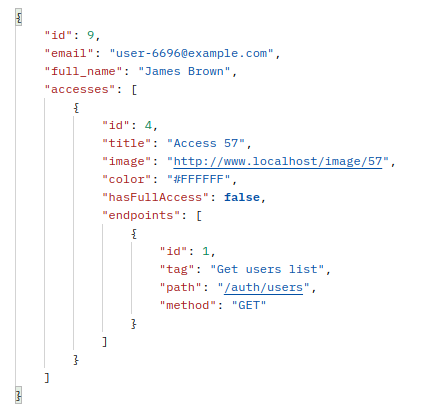
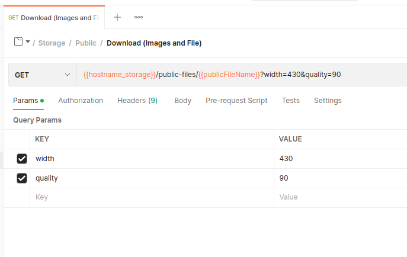
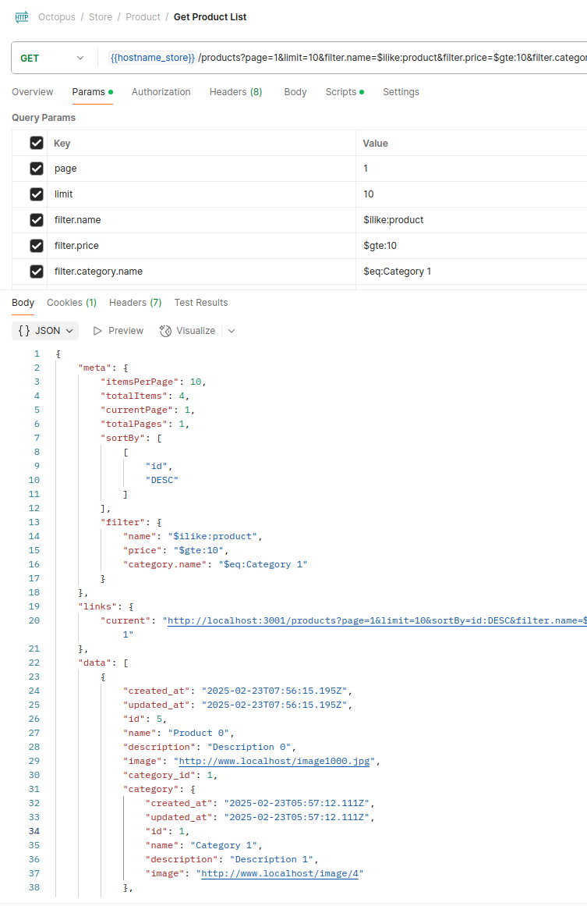

# Oculus


## Did you know?

An **oculus** is Latin for “eye” symbolizing vision and insight. This project is designed to give developers a clear view into building scalable microservices.

## About

**Oculus** is a scalable microservices template built with **NestJS**, **RabbitMQ**, **PostgreSQL**, and **Redis**. It provides an efficient and developer-friendly foundation for building distributed systems, supporting both Docker and Kubernetes deployments. The system now leverages **Minio** for object storage, offering a reliable and scalable solution for handling files across services.

## Key Changes:

1- Kafka → RabbitMQ Migration:

- The description now mentions RabbitMQ instead of Kafka.
- To make it easier to develop.

## Getting Started

```bash
git clone https://github.com/Jeccoman/oculus.git

cd oculus
pnpm i
docker-compose up --build # For the first add the --build
```

## Web UI Tools

Note: The following ports **(8087, 15679 and 5549)** are defined in the `docker-compose` file.

### PgAdmin

- URL: [http://localhost:8087/](http://localhost:8087/)
- Authentication:

```yaml
username: test@test.com
password: randompassword2
connection:
  host-name_address: postgres
  port: 5432
  username: postgres
  password: randompassword
```

### Rabbitmq UI

- URL: [http://localhost:15679/](http://localhost:15679/)
- Authentication:

```yaml
username: user
password: randompassword
```

### Redis UI

- URL: [http://localhost:5549/](http://localhost:5549/)
- Authentication:

```yaml
username: user
password: randompassword
connection:
  host: redis
  port: 6379
  username: none
  password: none
```

### Minio

- URL: [http://localhost:9101/](http://localhost:9101/)
- Authentication:
  Note: connect to minio on port 9101 and create an Access Key

```yaml
username: admin
password: randompassword
```

```bash
mcli alias set oculus http://localhost:9100 admin randompassword
```

## Project Structure

```
oculus
|
├── apps
│   ├── auth
│   │   ├── Dockerfile
│   │   ├── Dockerfile.dev
│   │   ├── package.json
│   │   ├── src
│   │   ├── test
│   │   └── tsconfig.app.json
│   │   └── .env
│   ├── storage
│   │   ├── Dockerfile
│   │   ├── Dockerfile.dev
│   │   ├── package.json
│   │   ├── src
│   │   ├── test
│   │   └── tsconfig.app.json
│   │   └── .env
│   └── store
│       ├── Dockerfile
│       ├── Dockerfile.dev
│       ├── package.json
│       ├── src
│       ├── test
│       └── tsconfig.app.json
│       └── .env
├── docker-compose-test.yaml
├── docker-compose.yaml
├── init-scripts
│   └── seed-data.sql
├── init-scripts-test
├── libs
│   └── common
│       ├── src
│       └── tsconfig.lib.json
├── migrations
│   ├── developing
│   │   ├── auth
│   │   ├── storage
│   │   └── store
│   ├── production
│   │   ├── auth
│   │   ├── storage
│   │   └── store
│   └── stage
│       ├── auth
│       ├── storage
│       └── store
├── package.json
├── tsconfig.build.json
└── tsconfig.json
└── .env
└── .env.test
└── .env.migration.developing
└── .env.migration.stage
└── .env.migration.production
```

## Services

### Auth



- Support dynamic access (role)
- Support auto Caching

### Storage



- Based on MinIO (S3 Object Storage)
- Support multiple file formats:
  - Images: jpg, jpeg, png, bmp, tiff, gif, webp
  - Documents: doc, docx, xlsx, pdf, txt, rtf
  - Media: mp3, wav, mp4, avi, avi, mkv
  - Compressed: zip, rar, tar, 7z, gz
- Support public and private files
- Support resizing and changing the quality of images on download routes
- Support caching on the download routes
- Unique route to upload all files
- Unique route to download all files (if the file is an image type, the system will automatically consider caching and editing utitlies for the file)

### Store



- Support fully Pagination
- Support auto Caching

## Swaggers

- Auth Service: [http://localhost:3000/docs#/](http://localhost:3000/docs#/)
- Store Service: [http://localhost:3001/docs#/](http://localhost:3001/docs#/)
- Storage Service: [http://localhost:3002/docs#/](http://localhost:3002/docs#/)

## Postman

### Online Link :

[](https://app.getpostman.com/run-collection/3450407-89d900a2-cca7-4169-907c-7659658167b2?action=collection%2Ffork&collection-url=entityId%3D3450407-89d900a2-cca7-4169-907c-7659658167b2%26entityType%3Dcollection%26workspaceId%3D035031a5-5824-405a-951d-be779a75439a)

### Download json files directly:Oculus

- [Collections](.postman-files/.postman_collection.json)
- [Admin User Environment](.postman-files/Oculus1-FullAccess.postman_environment.json)
- [Internal User Environment](.postman-files/Oculus2-InternalUser.postman_environment.json)
- [Regular User 1 Environment](.postman-files/Oculus3-User1.postman_environment.json)
- [Regular User 2 Environment](.postman-files/Oculus4-User2.postman_environment.json)

## Migration

There is possible to generate and run migration files on different branches separetly (developing, stage, production)

1. Create environment files - .env.migration.developing - .env.migration.stage - .env.migration.production
   example:

```
POSTGRES_HOST=localhost
POSTGRES_PORT=5436
POSTGRES_USERNAME=postgres
POSTGRES_PASSWORD=randompassword
# POSTGRES_SYNCHRONIZE=true
POSTGRES_SYNCHRONIZE=false
POSTGRES_AUTO_LOAD_ENTITIES=true
```

2. Edit the 'POSTGRES_ENTITIES' parameter inside the package.json file according to your entities
3. Generate and run the migratinos

```bash
# Developing
npm run migration:generate:developing
npm run migration:run:developing

# Stage
npm run migration:generate:stage
npm run migration:run:stage

# Production
npm run migration:generate:production
npm run migration:run:production
```

## Cache Manager

1. Only GET endpoints are cached.
2. Use `@NoCache()` decorator to bypass the caching system for specific endpoints.
3. Use `@GeneralCache()` decorator to cache the endpoint without including the user's token in the cache key.
4. Services caching status:

| Service Name | Module     | Cache Status | Decorator       | Note                                 |
| ------------ | ---------- | ------------ | --------------- | ------------------------------------ |
| Auth         | auth       | not cached   | @NoCache()      |                                      |
| Auth         | users      | cached       |                 | are cached according to user's token |
| Auth         | accesses   | cached       |                 | are cached according to user's token |
| Store        | categories | cached       | @GeneralCache() |                                      |
| Store        | products   | cached       | @GeneralCache() |                                      |
| Store        | orders     | not cached   | @NoCache()      |                                      |
| Store        | payments   | not cached   | @NoCache()      |                                      |
| Storage      |            | not cached   |                 |                                      |

## 🧪 Run Tests

### ✅ Unit Tests

Run unit tests:

```bash
pnpm run test
```

### 🔄 End-to-End (E2E) Tests

1️⃣ Start required services (database, Redis, etc.) in Terminal 1:

```bash
docker-compose -f ./docker-compose-test.yaml up
```

2️⃣ Run E2E tests in Terminal 2:

```bash
pnpm run test:e2e
```

## Roadmap

- [x] App microservices
- [x] Common libraries
- [x] Logger
- [x] Communication between microservices
- [x] Authentication (JWT, Cookie, Passport)
- [x] Dynamic roles (Access)
- [x] TypeORM Postgresql
  - [x] Entities
  - [x] Migrations on every branch separately
- [x] Docker-compose
- [x] Env
- [x] Document
  - [x] Githab Readme
  - [x] Postman
  - [x] Auto generated swagger
- [ ] Test
- [x] Cache Manager (Redis)
- [ ] K8S

## TODO

- [x] Fix Get OTP to expire its session
- [x] full_name nullable
- [ ] Category Tree
- [x] Get Lists be able to support the pagination
- [ ] Refresh Token

## Contributing

Contributions are welcome! Please read [CONTRIBUTING.md](CONTRIBUTING.md) for details on our code of conduct, and the process for submitting pull requests.

## License

This project is licensed under the MIT License - see the [LICENSE.md](LICENSE.md) file for details.

## Change log

### Unreleased

- Hardened auth login to return `401 Unauthorized` for unknown users instead of failing on missing credentials state.
- Fixed OTP generation to always produce a valid 5-digit code.
- Added focused auth service unit tests for invalid login handling and OTP generation.

### 3.0.0 (2025-02-23)

- Supporting Pagination for list retrieval endpoints.
- Sending `EVENT_NAME_USER_CREATED` and `EVENT_NAME_USER_UPDATED` from the 'auth' service to the 'store' service to update users.

### 2.1.2 (2025-02-17)

- Transition from JWT_SECRET into JWT_PUBLIC_KEY and JWT_PRIVATE_KEY
- Fxied access guard
- Fixed cache manager and added `FoceToClearCache` decorator
- Added new API route to edit user access /users/{id}/access

### 2.1.1 (2025-02-16)

- Improved the Health Check API to monitor infrastructure connections, including RabbitMQ, PostgreSql and Redis.

### 2.1.0 (2025-02-16)

- Moved entity files into their respective service directories.
- Fixed the migration script

### 2.0.2 (2025-02-13)

- Added some unit and e3e tests

### 2.0.1 (2025-01-27)

- Added database seed data during intializing (docker-compose)
- Renamed `cannotBeDeleted` field to `cannot_be_deleted`
- Added downloadable Postman files

### 2.0.0 (2025-01-26)

- Migrated from saving files on disk to leveraing the Minio for object storage.

### 1.0.0 (2025-01-25)

- Migrated from Kafka to RabbitMQ.
- Changed the 'hasFullAccess' field to 'has_full_access' in the `access` entity.

### 0.0.2 (2025-01-25)

- Added a caching prefix to support separation of multiple branches in production.
- Added Redis Insight to the docker-compose file to provide a GUI for Redis.

### 0.0.1 (2024-06-04)

- Initial release.
